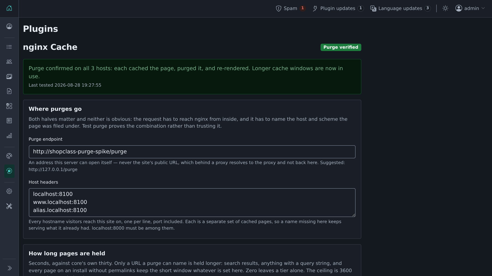

# nginx Cache

Hold pages in nginx's FastCGI cache for an hour instead of thirty seconds, and purge them
the moment a listing changes.

Verified end to end against nginx 1.31.3 with `ngx_cache_purge`.

## Install

From the admin: **Plugins → Manage plugins → Browse**, find *nginx Cache*, then **Install**.
Or: `php oc-cli.php market:install nginx-cache`. Needs Shopclass 6.2.0 or later (tested up
to 6.4).

## What it is for

Shopclass sets `Cache-Control: public, s-maxage=30` on public pages, and nginx honours it.
Thirty seconds is short because nothing can invalidate an entry — time is the only
eviction. That means the origin re-renders every URL every thirty seconds for as long as
anyone is looking at it.

This plugin lengthens the window and takes responsibility for correctness instead: when a
listing changes, the pages showing it are purged immediately.

What it does **not** buy is page speed: with `use_stale updating` + `background_update on`,
an expiring entry is already served stale in under a millisecond while it refreshes behind
the request. The saving is origin renders — one per URL per hour instead of one per thirty
seconds.

## What it requires

nginx built with `ngx_cache_purge`. That module is not in the official image; it builds
cleanly as a **dynamic** module against current nginx (verified on 1.31.3) in a two-stage
Dockerfile, which is stock nginx plus one module rather than a switch to OpenResty. The
plugin's **Setup** page prints the Dockerfile, the `load_module` line and the purge
`location` block for this install.

The bundled Shopclass Docker image ships it preconfigured. A standalone install adds it by
hand.

## Safety

The longer window is **gated on a self-test**. Until the plugin has primed a URL, purged
it, and confirmed the entry is gone, it serves core's own thirty seconds. A long window
with a purge that quietly does not work is worse than no plugin at all — the failure is
invisible and lasts an hour — so it is not something the plugin will do on trust. The flag
clears whenever the endpoint or host changes.

## What it purges, and what it does not

Purged, because their URLs can be named: the listing itself and one per locale, the
homepage, the listing's category page, and the seller's public profile.

Not purged, and so left on core's short window:

- **search results carrying parameters** — every keyword, filter, sort and page number is
  its own cache entry, the set cannot be enumerated, and a newly posted listing has to
  appear in them;
- **any URL with a query string**, including `?comments-page=2` on a listing and
  `?utm_source=…` on the home page. Each is a separate cache entry that no purge names;
- **every page, if permalinks are off**, since the canonical URL of each is then a query
  URL itself.

The rule behind all three: a page is held longer only when the URL being served is the one
a purge will name.

## Events it listens to

The set the Cloudflare plugin uses, which is the tested list of what core actually fires,
plus one more:

`posted_item`, `edited_item`, `after_delete_item`, `enable_item`, `disable_item`,
`activate_item`, `deactivate_item`, `item_premium_on`, `item_premium_off`,
`item_expiration_updated`, `add_category`, `after_delete_category`, `edit_page`,
`after_delete_page`, and **`invalidate_item_cache`**.

The last one (6.2.0+) fires when a storage offload moves a listing's images.

## Relationship to the Cloudflare plugin

They compose. `shopclass-plugin-cloudflare` owns the edge; this owns the origin. Both hang
off the same core hooks and share no code. Run either or both.

## Configuration

Two pages under **Plugins**: the settings, and a **Setup** page that prints the nginx
configuration this install needs — its own host, its own scheme, its own nginx version —
rather than a sample to adapt. The same config is in
[`nginx/shopclass-cache.conf`](nginx/shopclass-cache.conf) for reading outside the admin.

| Preference (`nginx_cache` section) | Default |
|---|---|
| `purge_endpoint` | `$SHOPCLASS_PURGE_ENDPOINT`, else `<nginx's scheme>://127.0.0.1/purge` |
| `purge_host` | `$SHOPCLASS_PURGE_HOST`, else the site's host and port. One per line — see below |
| `ttl_item`, `ttl_page`, `ttl_aggregate` | 3600, capped at 3600 |

Both halves of the endpoint matter and neither is obvious: the request must reach the
origin **and** present the host and scheme the cache key was built with. **Test purge**
proves that combination rather than trusting it, and changing either setting closes the
gate again.

**List every hostname the site answers on.** nginx files a separate copy of each page
under each `Host` it was asked with, so a name left out goes on serving what it already
had for the whole window — `www.example.com` when the site is configured as
`example.com`, an alias, a staging domain. Test purge primes and purges each one in turn,
because priming with `Host: X` files an entry under X and can therefore prove it. The one
thing it cannot prove is that those names are what visitors send, so it requires the
site's own host to be among them: a list of typos would otherwise verify itself perfectly
and purge nothing anybody reads.

Times are capped at 3600 seconds. Past that, the form token in a cached page can expire
before a visitor submits the form.

## Extending

| Filter | Purpose |
|---|---|
| `nginx_cache_item_urls` | add URLs for a theme's own item routes |
| `nginx_cache_purge_urls` | take the whole list and deliver it somewhere else |

## Licence

GPL-3.0-or-later. © Navjot Tomer (Mindstellar) and contributors.
